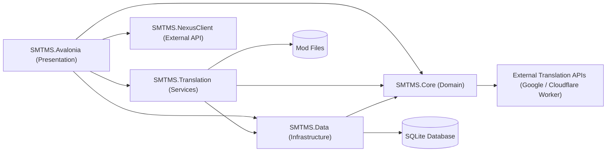
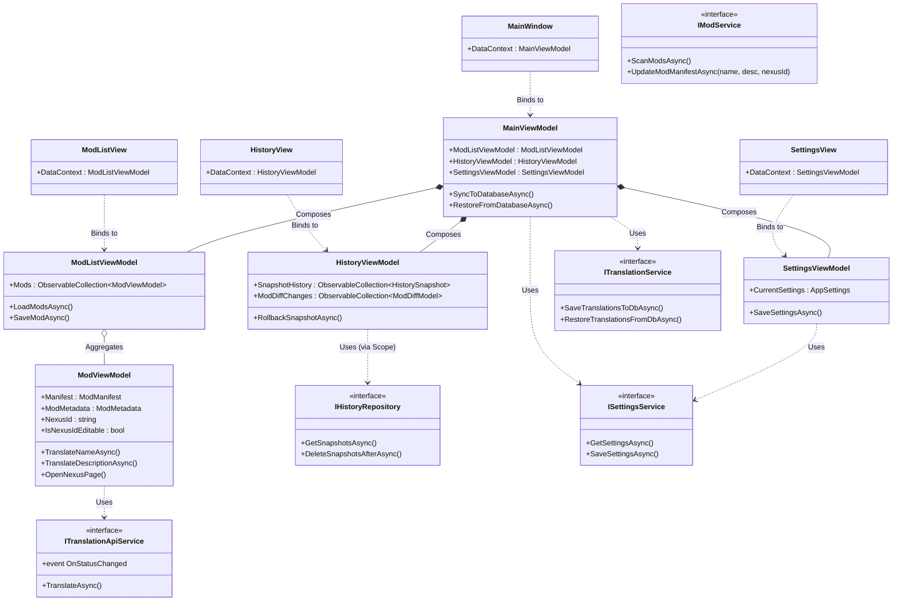
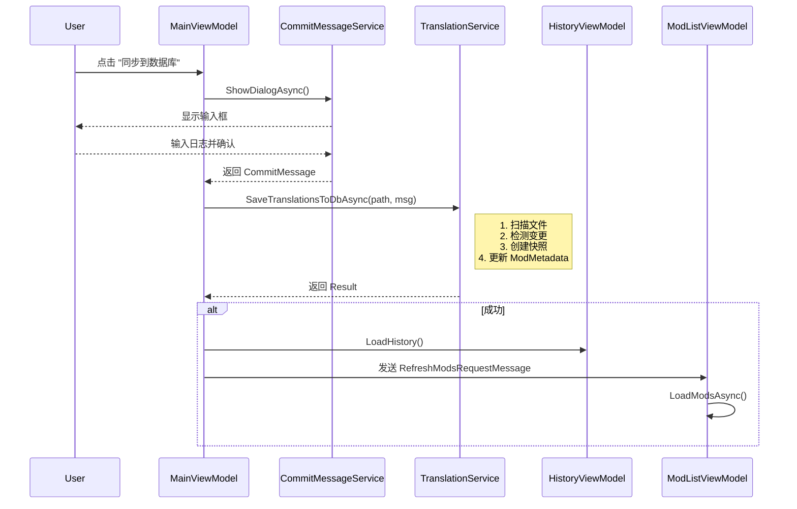
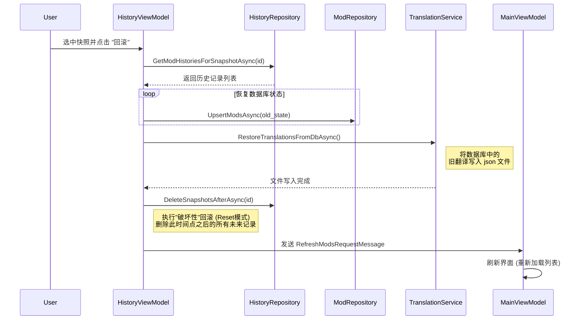
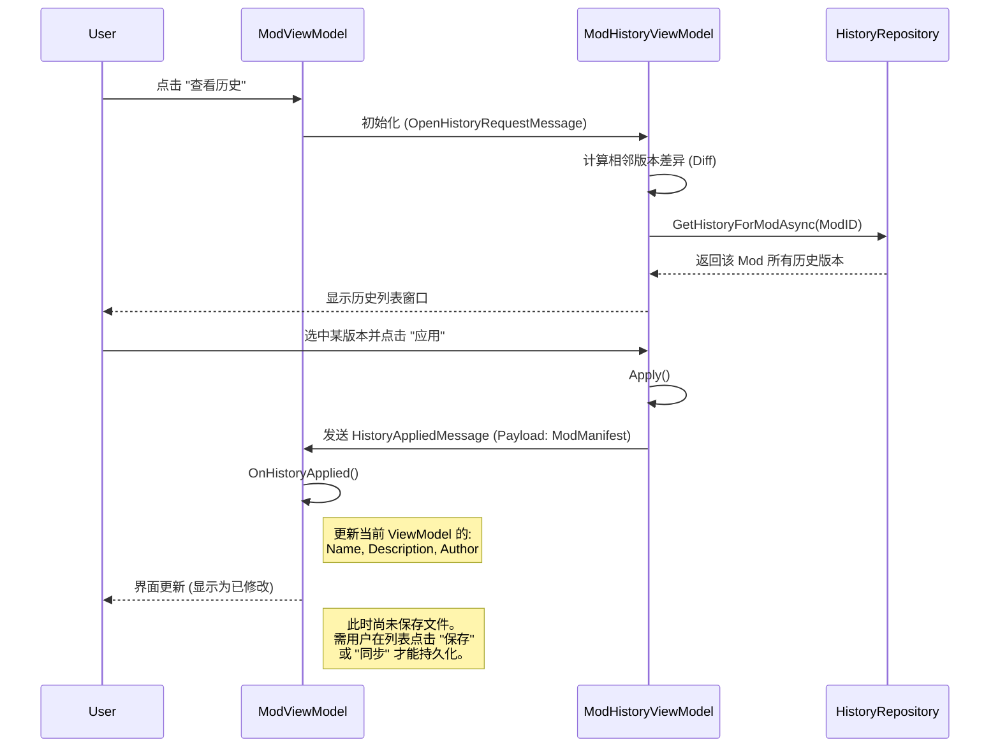

# SMTMS 系统架构文档

<!-- 更新规则 -->
<!-- Role: System Architect Rule: -->
<!-- 1. Maintain the System Blueprint (Current State). -->
<!-- 2. No Changelog language (Avoid "Added", "Improved", "Updated"). -->
<!-- 3. Only update if the Mermaid diagrams or Module Responsibilities have structural shifts. -->
<!-- 4. If the change is purely internal logic, Do Not Update. -->

本文档旨在描述 SMTMS (Stardew Mod Translation & Management System) 的系统设计与实现细节。

---

## 1. 顶层架构 (High-Level Architecture)

SMTMS 采用经典的分层架构设计，各模块之间通过接口解耦，依赖流向清晰。

### 模块职责

*   **SMTMS.Core**: 系统的核心领域层。定义了所有的数据模型（Model，含 `AppSettings`）、服务接口（`ISettingsService`, `ITranslationApiService`）以及通用的工具类。包含 `GoogleTranslationService` 等外部 API 实现。
*   **SMTMS.Data**: 数据基础设施层。负责数据的持久化存储（含 `SettingsService` 实现）。使用 Entity Framework Core 操作 SQLite 数据库。
*   **SMTMS.Translation**: 业务逻辑层。专注于翻译数据的处理、文件扫描、历史快照的生成与恢复逻辑。
*   **SMTMS.Avalonia (UI)**: 用户界面层。基于 **Avalonia** 框架，采用 MVVM 模式组织代码。

### 1.1 静态架构类图 (Static Class Diagram)

展示了 UI 层通过 ViewModel 与 Service 层的交互，以及 View 与 ViewModel 的绑定关系。

---

## 2. 核心子系统

### 2.1 增量历史版本控制系统 (Incremental History System)

SMTMS 不依赖外部 VCS 工具，而是内置了一套基于关系型数据库的轻量级版本控制机制。

#### 数据模型
*   **`HistorySnapshot` (快照)**: 代表一次“提交”或“同步”操作。包含时间戳、日志消息以及该时刻受管理的模组总数。
*   **`ModTranslationHistory` (历史记录)**: 存储特定模组在特定快照时刻的状态。
    *   **字段**: `JsonContent` (完整的元数据JSON), `FileHash` (内容指纹)。
    *   **存储策略**: 仅当模组内容与上一版本不同时才创建新记录（增量存储）。

#### 工作流程
1.  **目录扫描**: 当用户触发同步时，系统扫描 `Mods` 目录下的首层子文件夹（浅层扫描），确保与游戏加载逻辑及 UI 显示保持一致。
2.  **变更检测**: 计算每个模组当前状态的 Hash 值，与数据库中最新记录进行比对。
3.  **增量保存**: 仅将发生变更的模组的完整 JSON 内容写入 `ModTranslationHistories` 表。**若无任何变更，则跳过快照创建**，避免产生空快照。

### 2.2 翻译注入与恢复系统 (Translation Injection System)

该系统保证了用户汉化成果的持久性，使其独立于模组文件本身的更新。

*   **提取 (Scan & Save)**: 解析模组的 `manifest.json`，提取 `Name`, `Description`, `NexusId` 等关键字段，更新到数据库的 `ModMetadata` 表中。
*   **注入 (Restore)**: 利用 `SMTMS.Core` 中的正则工具类精确匹配并替换 `manifest.json` 中的对应字段值，确保 JSON 格式（包括注释和缩进）不被破坏。

### 2.3 NexusId 管理系统 (NexusId Management)
该系统允许用户为模组添加或编辑 Nexus Mods ID，并将其持久化到 manifest.json 文件中。

*   **数据存储**: NexusId 直接写入 `manifest.json` 的 `UpdateKeys` 数组（格式：`"Nexus:12345"`），与 Name/Description 保持一致的存储策略。
*   **可编辑性判断**: 
    *   模组**原本自带** NexusId → 只读（防止误修改）
    *   模组**没有** NexusId 或**用户之前添加**的 → 可编辑
    *   数据库 `ModMetadata` 存储同步的 `NexusId` 及 `IsNexusIdUserAdded` 标记
*   **历史追踪**: `ModDiffModel.UpdateKeysChange` 字段记录 NexusId 的变更，支持在历史界面查看和回滚。
*   **UI 交互**: 
    *   输入框根据可编辑性动态切换只读/可编辑状态
    *   "链接"按钮仅在有 NexusId 时显示，点击打开 Nexus Mods 页面
    *   修改后显示加粗斜体（未保存）→ 保存后显示加粗（已保存未同步）→ 同步后恢复正常

### 2.4 配置管理系统 (Configuration System)
负责应用程序的全局设置管理，支持持久化存储。

*   **`AppSettings`**: 配置模型，包含 Mods 路径、窗口尺寸、主题设置 (Dark/Light)、自动扫描开关、翻译 API 配置等。
*   **`ISettingsService`**: 提供配置的读写接口。`MainViewModel` 在初始化时通过此服务加载用户首选项。

### 2.5 外部翻译集成 (External Translation Integration)
系统集成了在线翻译服务，辅助用户快速翻译模组信息，并具备自动故障转移能力。

*   **`ITranslationApiService`**: 定义通用的翻译接口，包含异步翻译方法及状态通知事件 (`OnStatusChanged`)。
*   **实现**: `GoogleTranslationService`。
    *   **主线路**: Google Translate API Free 节点。
    *   **备用线路 (Fallback)**: Cloudflare Worker 代理 API。
    *   **弹性策略 (Resilience)**: 使用 **Polly** 构建重试 (Retry) 与降级 (Fallback) 策略管道。当主线路发生网络异常时自动重试，失败后无缝切换至备用线路。
    *   **响应性体验**: 集成了超时检测逻辑，超过 1 秒未完成的请求将触发状态提示。
*   **功能**: 支持自动检测源语言，将模组名称或描述翻译为目标语言（默认为中文）。

---

## 3. 关键交互流程 (Sequence Diagrams)

### 3.1 同步与快照生成流程

### 3.2 历史回滚流程

### 3.3 单模组历史查看与应用流程 (Single Mod History)

---

## 4. 技术栈 (Technology Stack)

*   **Runtime**: .NET 8.0
*   **UI Framework**: Avalonia UI (Cross-platform)
    *   **Theme**: Semi.Avalonia (Modern Design System)
*   **ORM**: Entity Framework Core (SQLite Provider)
*   **Utils**:
    *   `CommunityToolkit.Mvvm`: MVVM 模式支持
    *   `Polly`: 弹性网络策略 (Retry & Fallback)
    *   `DiffPlex`: 文本差异比对算法
    *   `Newtonsoft.Json`: JSON 序列化处理
