# SMTMS 架构总览（Architecture Overview）

本文件从三个层次描述 SMTMS：

1. **顶层模块依赖图**：各项目（Core/Data/GitProvider/NexusClient/Translation/UI）之间的引用关系。
2. **模块内部组件图**：每个模块内部的接口、实现类和关键模型，以及它们之间的依赖。
3. **关键用例时序图**：加载 Mods、保存翻译、导入历史数据、应用翻译到 manifest、Git 回滚等核心流程。

> 说明：本文件中的 Mermaid 图可在支持 Mermaid 的 Markdown 工具中直接渲染；也可用 Mermaid CLI 或在线工具导出为 HTML/SVG。

---

## 1. 顶层模块依赖关系

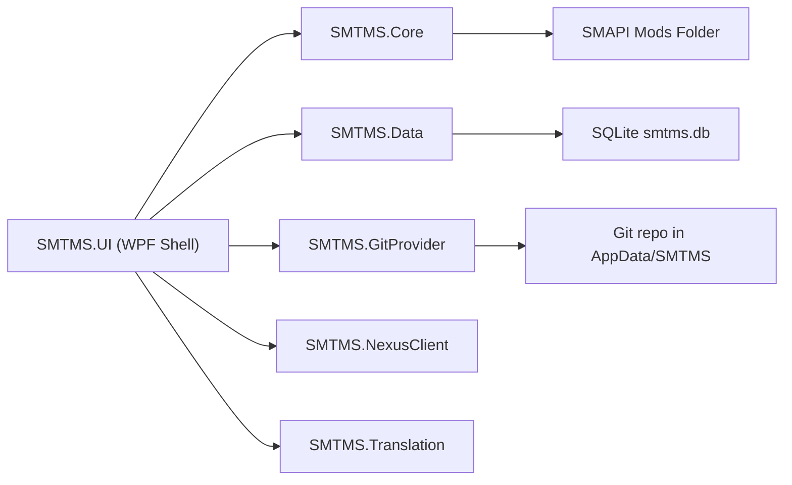

### 1.1 模块职责简述

- **SMTMS.Core**：领域与接口层

  - 定义接口：`IModService`, `IModRepository`, `IGitService`, `IGitDiffCacheService`, `INexusClient`, `ITranslationService`, `IGamePathService`, `ISettingsService`。
  - 定义模型：`ModManifest`, `ModMetadata`, `TranslationMemory`, `GitCommitModel`, `ModDiffModel`, `GitDiffCache`, `NexusModDto`, `AppSettings` 等。
  - 定义通用类型：`Result<T>`, `OperationResult` (统一错误处理模式)。
  - 服务实现：`ModService`, `RegistryGamePathService`。

- **SMTMS.Data**：数据访问层

  - `AppDbContext`（EF Core + SQLite）。
  - `ModRepository : IModRepository`，负责 `ModMetadata` / `TranslationMemory` / `GitDiffCache` 的 CRUD。
  - `GitDiffCacheService : IGitDiffCacheService`，负责 Git Diff 缓存的读取、保存和清理（使用 MessagePack 序列化）。
  - `SettingsService : ISettingsService`，负责应用配置（如最后使用的 Mods 目录、窗口尺寸等）的持久化。
  - **性能优化**：
    - 为常用查询字段添加索引（`LastTranslationUpdate`, `RelativePath`, `Engine`, `Timestamp`, `CreatedAt`）。
    - 新增 `LastFileHash` 用于内容指纹快速比对。
    - 所有只读查询使用 `AsNoTracking()` 减少内存占用（30-50%）。
    - 所有异步方法支持 `CancellationToken`，允许取消长时间操作。

- **SMTMS.GitProvider**：Git 集成

  - `GitService : IGitService`，基于 LibGit2Sharp 对 `%APPDATA%/SMTMS` 仓库进行 `Init/Commit/Reset/GetHistory` 等操作。

- **SMTMS.NexusClient**：Nexus API 客户端

  - `NexusClient : INexusClient`，占位实现，后续连接 Nexus Mods REST/GraphQL API。

- **SMTMS.Translation**：翻译服务实现

  - 核心实现 `TranslationService : ITranslationService`，负责在 "本地 manifest.json" 与 "SQLite 数据库" 之间双向同步翻译数据 (Extract/Restore)。
  - **架构改进**：
    - 从 Core 层移至独立的 Translation 层，实现真正的分层架构。
    - 使用构造函数注入 `ILogger<TranslationService>` 和 `IServiceScopeFactory`。
    - 所有方法返回 `OperationResult`，提供统一的错误处理和详细的操作结果。
  - **性能优化**：
    - 使用 C# 11+ `[GeneratedRegex]` 特性，编译时生成优化的正则表达式代码（2-5倍性能提升）。
    - 并行文件处理（`Task.WhenAll`），充分利用多核 CPU。
    - 批量数据库操作，减少往返次数。
    - 支持 `CancellationToken`，允许取消长时间操作。
  - **日志改进**：
    - 结构化日志记录，包含关键业务上下文（文件数量、成功/失败计数、错误详情）。
    - 使用适当的日志级别（Debug/Information/Warning/Error）。

- **SMTMS.UI**：WPF 前端 & 组合根
  - 使用 `Host.CreateDefaultBuilder` 配置 DI、数据库、服务与 ViewModel。
  - 应用数据库迁移，创建并显示 `MainWindow`。
  - 所有依赖通过构造函数注入，遵循标准 DI 模式。

---

## 2. 模块内部结构

### 2.1 核心层（SMTMS.Core）组件关系

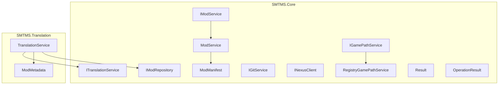

要点：

- **接口全部定义在 Core 中**，实现分别在 Core/Data/GitProvider/NexusClient/Translation 等模块中。
- `TranslationService` 位于独立的 Translation 层，通过 `IServiceScopeFactory` 动态获取 `IModRepository`，避免直接依赖 SMTMS.Data。
- 所有服务使用构造函数注入 `ILogger<T>`，遵循标准依赖注入模式。
- 使用 `Result<T>` 和 `OperationResult` 模式进行统一错误处理。

### 2.2 数据层（SMTMS.Data）

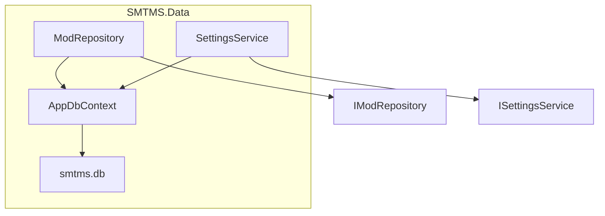

- `AppDbContext`：配置 SQLite，定义 `DbSet<ModMetadata>`、`DbSet<TranslationMemory>`、`DbSet<GitDiffCache>` 和 `DbSet<AppSettings>`。
- `ModRepository`：实现 `IModRepository`，封装对 EF Core 的访问逻辑，提供单个和批量操作接口：
  - `GetModAsync(string uniqueId, CancellationToken)`：查询单个 Mod。
  - `GetModsByIdsAsync(IEnumerable<string> uniqueIds, CancellationToken)`：批量查询多个 Mod，返回 `Dictionary<string, ModMetadata>`，避免 N+1 查询问题。
  - `UpsertModAsync(ModMetadata mod, CancellationToken)`：插入或更新单个 Mod。
  - `UpsertModsAsync(IEnumerable<ModMetadata> mods, CancellationToken)`：批量插入/更新 Mod，收集所有变更后一次性提交，大幅减少数据库往返次数。
- `GitDiffCacheService`：实现 `IGitDiffCacheService`，提供 Git Diff 缓存管理：
  - `GetCachedDiffAsync(string commitHash, CancellationToken)`：从缓存中获取 Diff 数据。
  - `SaveDiffCacheAsync(string commitHash, List<ModDiffModel> diffData, CancellationToken)`：保存 Diff 数据到缓存。
  - `ClearOldCachesAsync(int daysToKeep, CancellationToken)`：清理过期缓存（基于时间）。
  - `ClearLRUCachesAsync(int maxCacheCount, CancellationToken)`：LRU 缓存清理策略，保留最新 N 个缓存。
  - `SmartClearCachesAsync(int daysToKeep, int maxCacheCount, CancellationToken)`：智能缓存清理，结合时间和数量限制。
- **性能优化**：
  - `GitDiffCache` 表用于缓存 Git Diff 结果，避免重复计算。
  - 为高频查询字段添加数据库索引（`LastTranslationUpdate`, `RelativePath`, `Engine`, `Timestamp`, `CreatedAt`）。
  - 支持 MessagePack 序列化以加速数据读写。
  - 批量数据库操作减少往返次数。
  - 并行文件读取利用多核CPU加速I/O操作。
  - 所有只读查询使用 `AsNoTracking()` 减少内存占用。
  - 正则表达式使用 `[GeneratedRegex]` 编译时优化。
  - 所有异步方法支持 `CancellationToken`，允许取消长时间操作。
  - LRU 缓存清理策略防止缓存表无限增长。

### 2.3 Git 集成模块（SMTMS.GitProvider）

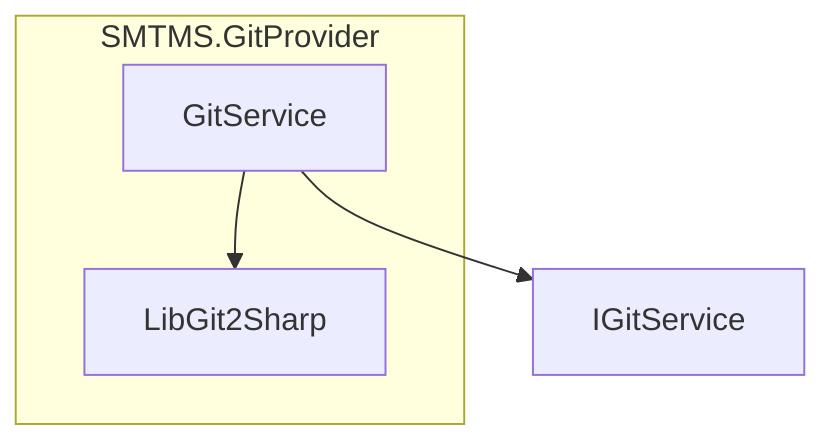

- `GitService`：使用 LibGit2Sharp，实现 `IsRepository/Init/Commit/Checkout/GetStatus/GetHistory/Reset`。
- **性能优化**：
  - `GetStructuredDiff` 使用并行处理（`Task.Run` + `Task.WaitAll`）加速多文件解析。
  - 支持增量加载和缓存机制（通过 `GitDiffCache` 表）。

### 2.4 UI 层与依赖注入（SMTMS.UI）

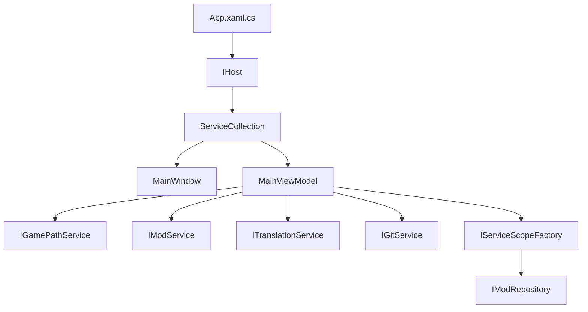

- `App` 构造函数中配置：
  - `AddDbContext<AppDbContext>()`（SQLite）。
  - `AddSingleton<IGitService, SMTMS.GitProvider.Services.GitService>()`。
  - `AddSingleton<IModService, ModService>()`。
  - `AddSingleton<IGamePathService, RegistryGamePathService>()`。
  - `AddScoped<IModRepository, ModRepository>()`。
  - `AddScoped<IGitDiffCacheService, GitDiffCacheService>()`。
  - `AddScoped<ISettingsService, SettingsService>()`。
  - `AddSingleton<ITranslationService, SMTMS.Translation.Services.TranslationService>()`。
  - `AddSingleton<MainViewModel>()`, `AddSingleton<MainWindow>()`。
- `OnStartup` 中：
  - 启动 Host。
  - 应用数据库迁移（`dbContext.Database.MigrateAsync()`）。
  - 解析并显示 `MainWindow`。

---

## 3. 关键用例时序图

本节用简化的时序图展示几个核心用户操作背后的调用关系。

### 3.1 加载 Mods（扫描并同步到数据库）

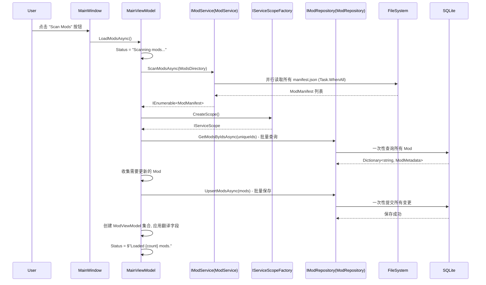

### 3.2 保存当前 Mod 的翻译 (Save Local Only)

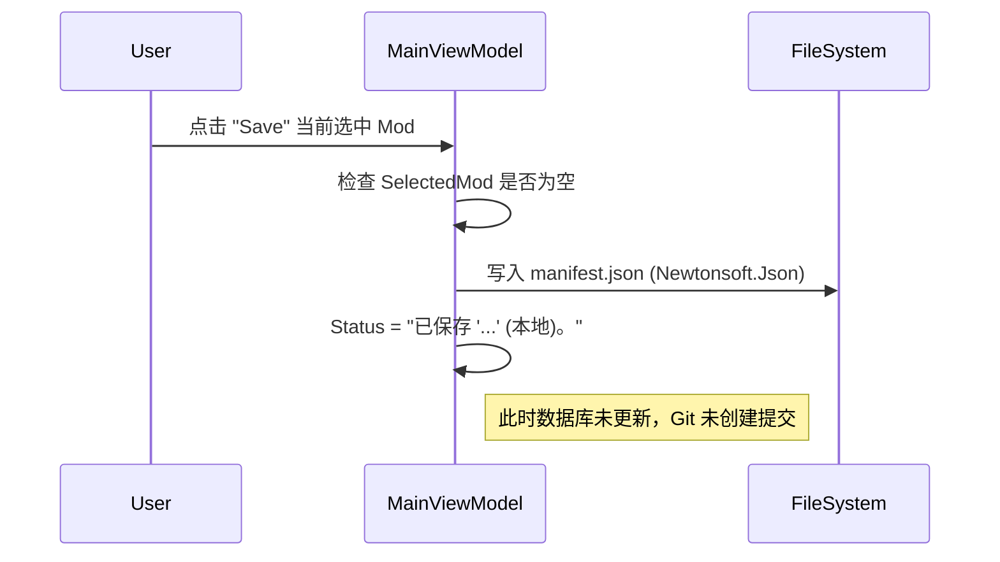

### 3.3 同步到数据库 & 创建版本 (Sync / Checkpoint)

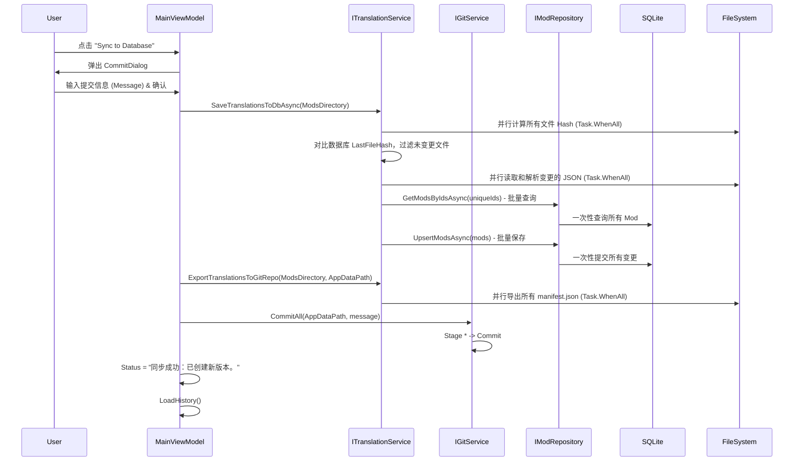

### 3.6 单模组回滚 (Single Mod Rollback)

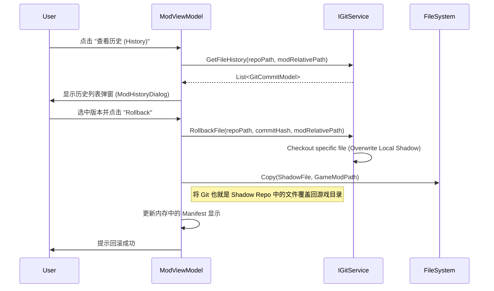

### 3.4 从数据库恢复翻译到模组 (Restore/Apply)

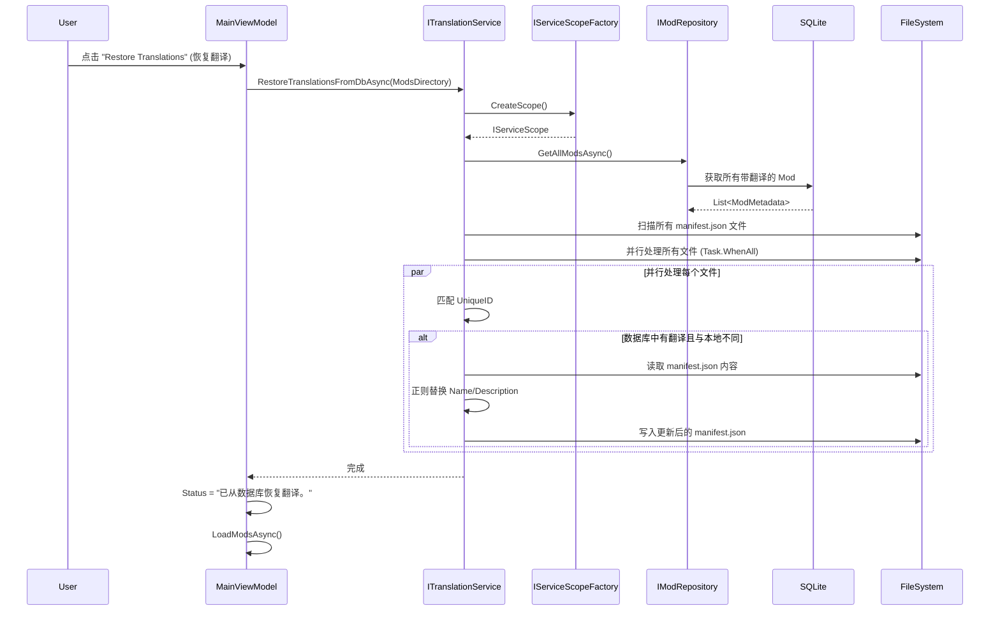

### 3.5 Git 回滚

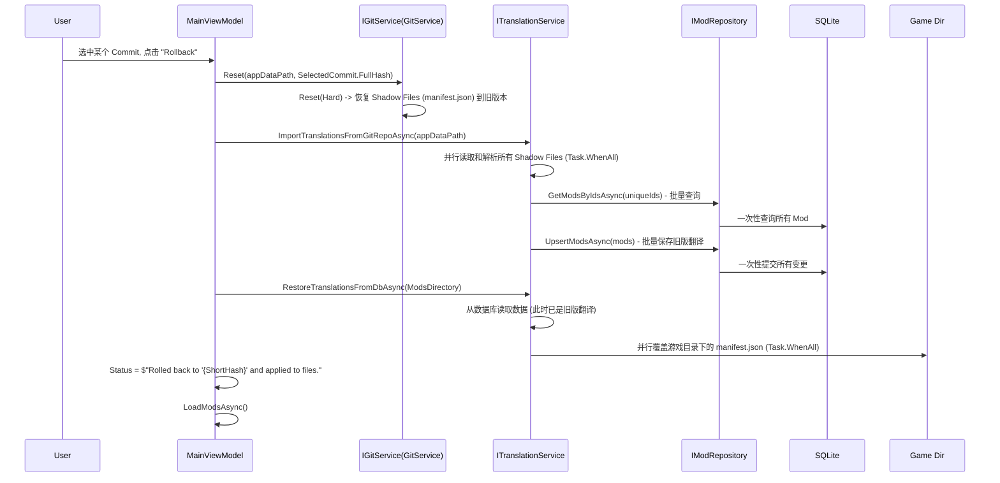
