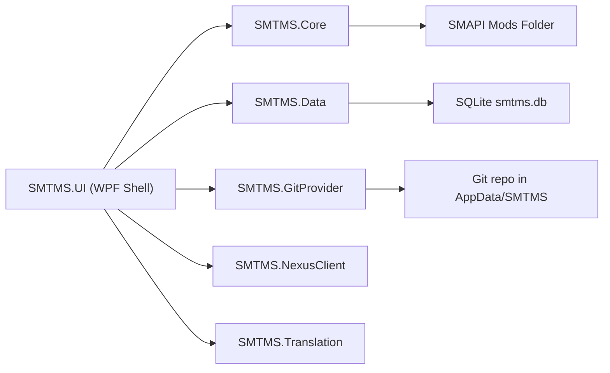
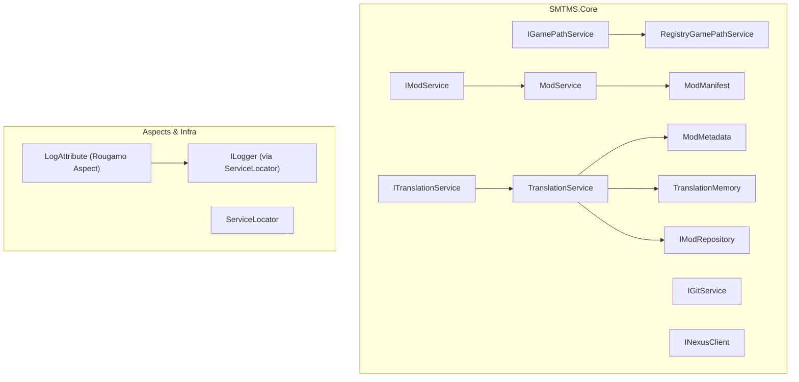
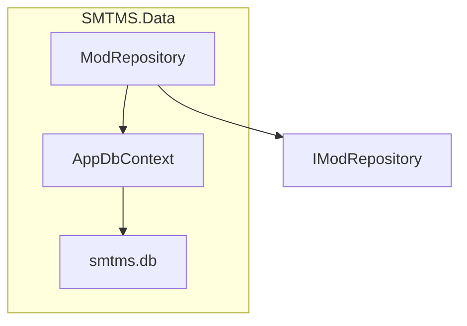
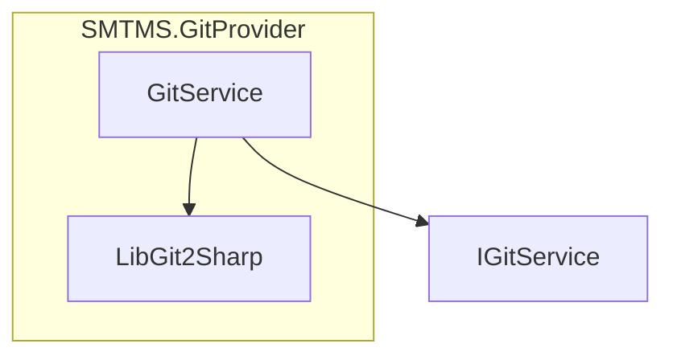
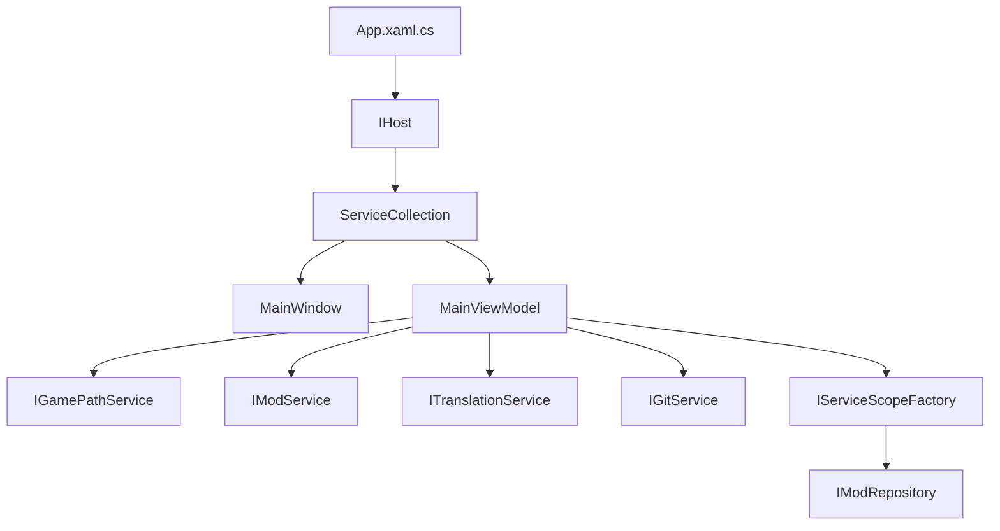
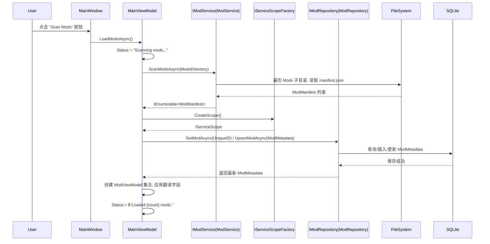
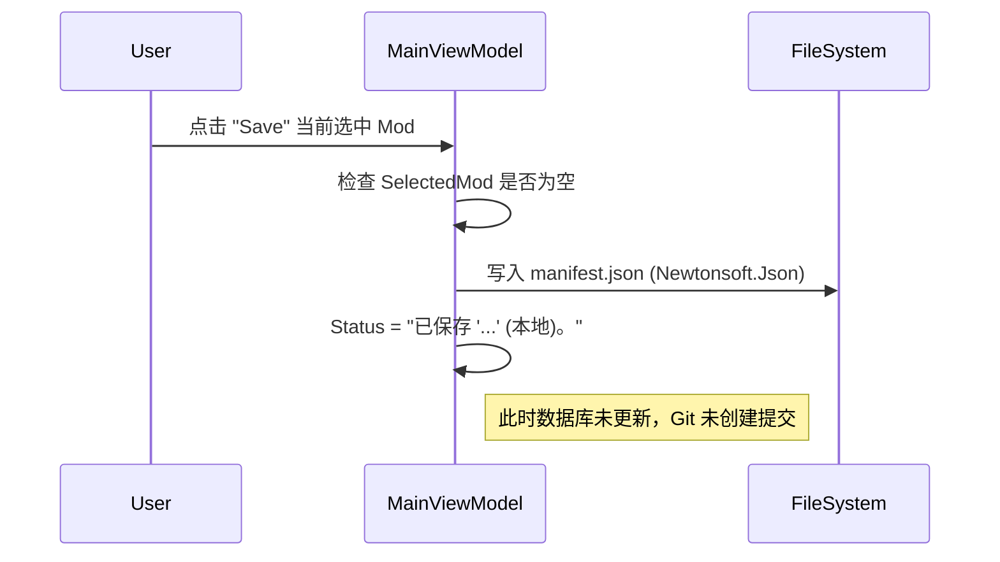
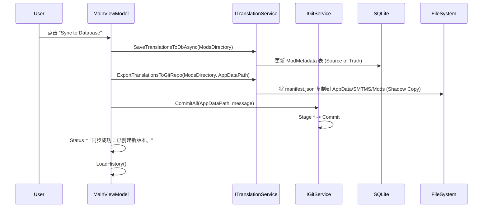
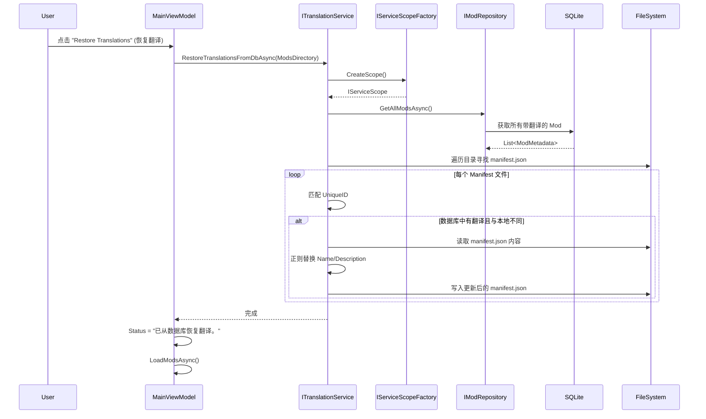
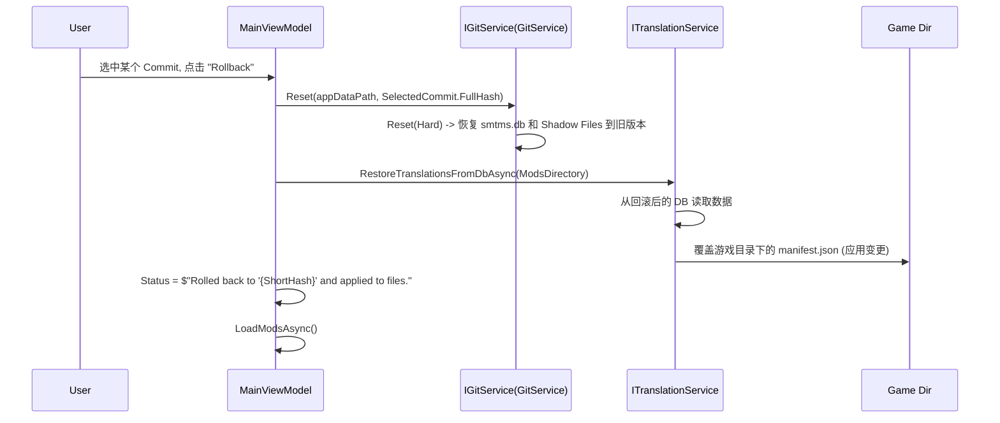

# SMTMS 架构总览（Architecture Overview）

本文件从三个层次描述 SMTMS：

1. **顶层模块依赖图**：各项目（Core/Data/GitProvider/NexusClient/Translation/UI）之间的引用关系。
2. **模块内部组件图**：每个模块内部的接口、实现类和关键模型，以及它们之间的依赖。
3. **关键用例时序图**：加载 Mods、保存翻译、导入历史数据、应用翻译到 manifest、Git 回滚等核心流程。

> 说明：本文件中的 Mermaid 图可在支持 Mermaid 的 Markdown 工具中直接渲染；也可用 Mermaid CLI 或在线工具导出为 HTML/SVG。

---

## 1. 顶层模块依赖关系

### 1.1 模块职责简述

- **SMTMS.Core**：领域与接口层

  - 定义接口：`IModService`, `IModRepository`, `IGitService`, `INexusClient`, `ITranslationService`, `IGamePathService`。
  - 定义模型：`ModManifest`, `ModMetadata`, `TranslationMemory`, `GitCommitModel`, `NexusModDto` 等。
  - `ModService`, `TranslationService` (负责提取/恢复翻译), `RegistryGamePathService`。
  - 提供横切基础设施：`LogAttribute`（AOP 日志）、`ServiceLocator`。

- **SMTMS.Data**：数据访问层

  - `AppDbContext`（EF Core + SQLite）。
  - `ModRepository : IModRepository`，负责 `ModMetadata` / `TranslationMemory` 的 CRUD。

- **SMTMS.GitProvider**：Git 集成

  - `GitService : IGitService`，基于 LibGit2Sharp 对 `%APPDATA%/SMTMS` 仓库进行 `Init/Commit/Reset/GetHistory` 等操作。

- **SMTMS.NexusClient**：Nexus API 客户端

  - `NexusClient : INexusClient`，占位实现，后续连接 Nexus Mods REST/GraphQL API。

- **SMTMS.Translation**：翻译服务实现

  - 核心实现 `TranslationService`，负责在 "本地 manifest.json" 与 "SQLite 数据库" 之间双向同步翻译数据 (Extract/Restore)。

- **SMTMS.UI**：WPF 前端 & 组合根
  - 使用 `Host.CreateDefaultBuilder` 配置 DI、数据库、服务与 ViewModel。
  - 初始化 `ServiceLocator`，创建并显示 `MainWindow`。

---

## 2. 模块内部结构

### 2.1 核心层（SMTMS.Core）组件关系

要点：

- **接口全部定义在 Core 中**，实现分别在 Core/Data/GitProvider/NexusClient 等模块中。
- `TranslationService` 通过 `IServiceScopeFactory` 动态获取 `IModRepository`，避免直接依赖 SMTMS.Data。
- `LogAttribute` 通过 `ServiceLocator` 拿到 `ILogger&lt;T&gt;`，对带 `[Log]` 的类/方法织入统一日志。

### 2.2 数据层（SMTMS.Data）

- `AppDbContext`：配置 SQLite，定义 `DbSet<ModMetadata>` 与 `DbSet<TranslationMemory>`。
- `ModRepository`：实现 `IModRepository`，封装对 EF Core 的访问逻辑。

### 2.3 Git 集成模块（SMTMS.GitProvider）

- `GitService`：使用 LibGit2Sharp，实现 `IsRepository/Init/Commit/Checkout/GetStatus/GetHistory/Reset`。

### 2.4 UI 层与依赖注入（SMTMS.UI）

- `App` 构造函数中配置：
  - `AddDbContext<AppDbContext>()`（SQLite）。
  - `AddSingleton<IGitService, GitService>()`。
  - `AddSingleton<IModService, ModService>()`。
  - `AddSingleton<IGamePathService, RegistryGamePathService>()`。
  - `AddScoped<IModRepository, ModRepository>()`。
  - `AddSingleton<ITranslationService, TranslationService>()`。
  - `AddSingleton<MainViewModel>()`, `AddSingleton<MainWindow>()`。
- `OnStartup` 中：
  - 启动 Host，
  - 调用 `ServiceLocator.Initialize(_host.Services)`，
  - 解析并显示 `MainWindow`。

---

## 3. 关键用例时序图

本节用简化的时序图展示几个核心用户操作背后的调用关系。

### 3.1 加载 Mods（扫描并同步到数据库）

### 3.2 保存当前 Mod 的翻译 (Save Local Only)

### 3.3 同步到数据库 & 创建版本 (Sync / Checkpoint)

### 3.4 从数据库恢复翻译到模组 (Restore/Apply)

### 3.5 Git 回滚

