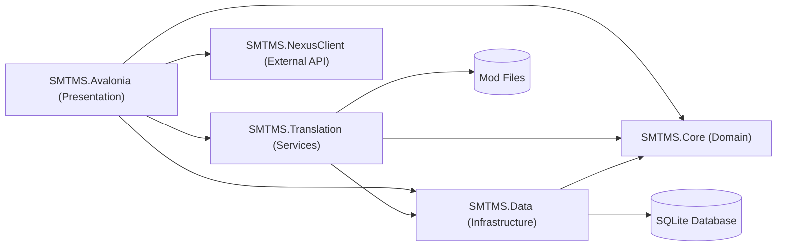
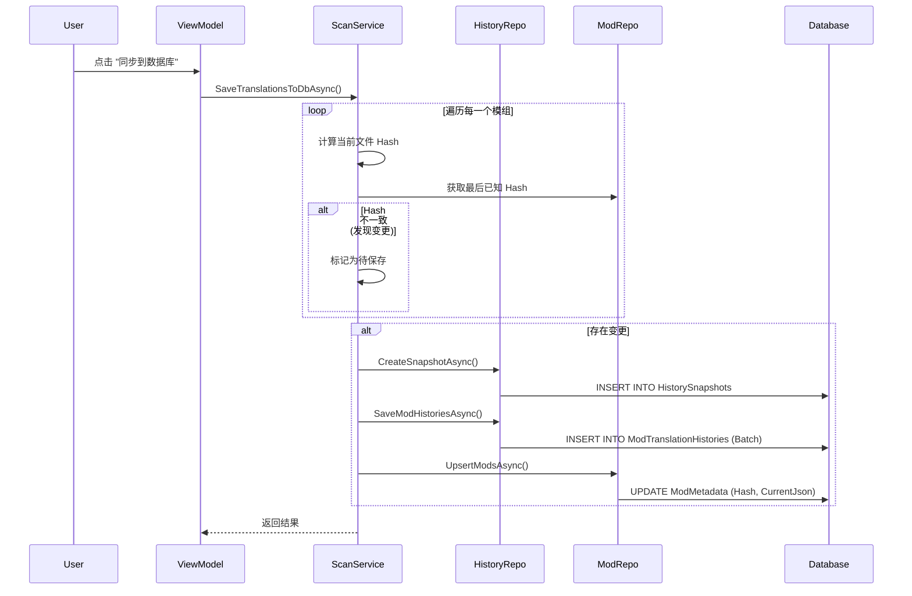

# SMTMS 系统架构文档

本此文档旨在描述 SMTMS (Stardew Mod Translation & Management System) 的系统设计与实现细节。

---

## 1. 顶层架构 (High-Level Architecture)

SMTMS 采用经典的分层架构设计，各模块之间通过接口解耦，依赖流向清晰。



### 模块职责

*   **SMTMS.Core**: 系统的核心领域层。定义了所有的数据模型（Model）、服务接口（Interface）以及通用的工具类（如 `ManifestTextReplacer` 文本处理）。不依赖任何具体的 UI 或数据库实现。
*   **SMTMS.Data**: 数据基础设施层。负责数据的持久化存储，实现了 Core 层的数据访问接口。使用 Entity Framework Core 操作 SQLite 数据库。
*   **SMTMS.Translation**: 业务逻辑层。专注于翻译数据的处理、文件扫描、历史快照的生成与恢复逻辑。
*   **SMTMS.Avalonia (UI)**: 用户界面层。基于 **Avalonia** 框架，采用 MVVM 模式组织代码，负责与用户交互及流程控制。通过调用 Core 接口（如 `IModService`）进行数据操作，严禁直接操作文件。

---

## 2. 核心子系统

### 2.1 增量历史版本控制系统 (Incremental History System)

SMTMS 不依赖外部 VCS 工具，而是内置了一套基于关系型数据库的轻量级版本控制机制。

#### 数据模型
*   **`HistorySnapshot` (快照)**: 代表一次“提交”或“同步”操作。包含时间戳、日志消息以及该时刻受管理的模组总数。
*   **`ModTranslationHistory` (历史记录)**: 存储特定模组在特定快照时刻的状态。
    *   **字段**: `JsonContent` (完整的元数据JSON), `FileHash` (内容指纹)。
    *   **存储策略**: 仅当模组内容与上一版本不同时才创建新记录（增量存储）。

#### 工作流程
1.  **目录扫描**: 当用户触发同步时，系统扫描 `Mods` 目录下的首层子文件夹（浅层扫描），确保与游戏加载逻辑及 UI 显示保持一致。
2.  **变更检测**: 计算每个模组当前状态的 Hash 值，与数据库中最新记录进行比对。
3.  **增量保存**: 仅将发生变更的模组的完整 JSON 内容写入 `ModTranslationHistories` 表。**若无任何变更，则跳过快照创建**，避免产生空快照。

### 2.2 翻译注入与恢复系统 (Translation Injection System)

该系统保证了用户汉化成果的持久性，使其独立于模组文件本身的更新。

*   **提取 (Scan & Save)**: 解析模组的 `manifest.json`，提取 `Name`, `Description` 等关键字段，更新到数据库的 `ModMetadata` 表中。
*   **注入 (Restore)**: 利用 `SMTMS.Core` 中的正则工具类精确匹配并替换 `manifest.json` 中的对应字段值，确保 JSON 格式（包括注释和缩进）不被破坏。

---

## 3. 关键交互流程 (Sequence Diagrams)

### 3.1 同步与快照生成流程



### 3.2 历史回滚流程

```mermaid
sequenceDiagram
    participant User
    participant HistoryVM
    participant HistoryRepo
    participant RestoreService
    participant FileSystem

    User->>HistoryVM: 在列表中选择快照，点击 "回滚"
    HistoryVM->>HistoryRepo: GetModHistoriesForSnapshotAsync(SnapshotId)
    
    note right of HistoryRepo: 查询逻辑：<br/>查找每个模组在 <= SnapshotId 时刻的<br/>最新一条历史记录
    
    HistoryRepo-->>HistoryVM: 返回历史模组状态列表
    
    loop 对每一个历史模组
        HistoryVM->>HistoryVM: 将 CurrentJson 重置为历史 JsonContent
    end
    
    HistoryVM->>RestoreService: RestoreTranslationsFromDbAsync()
    loop 对每一个模组
        RestoreService->>FileSystem: 读取 manifest.json
        RestoreService->>FileSystem: 正则替换并写入新内容
    end

### 3.3 单模组历史查看与应用流程

```mermaid
sequenceDiagram
    participant User
    participant ModVM
    participant ModHistoryVM
    participant HistoryRepo
    participant ModHistoryWindow

    User->>ModVM: 点击 "查看历史"
    ModVM->>ModHistoryVM: 实例化并订阅 OnApplyHistory
    ModHistoryVM->>HistoryRepo: GetHistoryForModAsync(ModID)
    HistoryRepo-->>ModHistoryVM: 返回该 Mod 所有历史版本
    
    ModHistoryVM->>ModHistoryVM: 计算相邻版本差异 (Diff)
    ModHistoryVM-->>ModHistoryWindow: 渲染历史列表
    ModVM-->>User: 显示弹窗
    
    User->>ModHistoryWindow: 选中某版本并点击 "应用"
    ModHistoryWindow->>ModHistoryVM: Apply()
    ModHistoryVM->>ModVM: 触发 OnApplyHistory 事件 (传递选中的 Manifest)
    
    ModVM->>ModVM: 更新界面上的 Name/Description
    note right of ModVM: 仅更新 UI 状态，<br/>需用户手动点击保存/同步<br/>以持久化更改
```
```

---

## 4. 技术栈 (Technology Stack)

*   **Runtime**: .NET 8.0
*   **UI Framework**: Avalonia UI (Cross-platform)
*   **ORM**: Entity Framework Core (SQLite Provider)
*   **Utils**:
    *   `CommunityToolkit.Mvvm`: MVVM 模式支持
    *   `DiffPlex`: 文本差异比对算法
    *   `Newtonsoft.Json`: JSON 序列化处理
